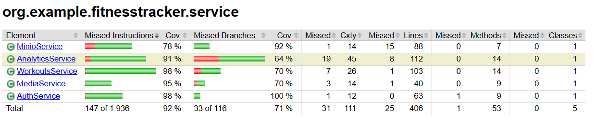

# Fitness Tracker API

## Описание

Backend-приложение для трекинга фитнес-активностей, которое позволяет пользователям записывать тренировки, отслеживать прогресс и анализировать показатели. Приложение реализовано на Spring Boot с использованием PostgreSQL для хранения данных и MinIO для хранения медиа-файлов.

## Архитектура проекта

Проект следует принципам чистой архитектуры с разделением на слои:

- **Controller** (`controller`) - REST API endpoints, обработка HTTP запросов
- **Service** (`service`) - бизнес-логика приложения
- **Repository** (`repository`) - доступ к данным через Spring Data JPA
- **DTO** (`dto`) - объекты передачи данных (request/response)
- **Model** (`model`) - сущности базы данных
- **Security** (`security`) - JWT аутентификация и авторизация
- **Exception** (`exception`) - глобальная обработка ошибок
- **Config** (`config`) - конфигурация Spring Security и других компонентов

## Быстрый старт

### Требования

- Java 21+
- Maven 3.9+
- Docker и Docker Compose
- PostgreSQL 15+ (или через Docker)

### Запуск через Docker Compose (рекомендуется)

1. **Создайте файл `.env` в корне проекта** со следующим содержимым:

```env
# PostgreSQL Configuration
POSTGRES_DB=fitness_tracker
POSTGRES_USER=user
POSTGRES_PASSWORD=password

# MinIO Configuration
MINIO_ROOT_USER=minioadmin
MINIO_ROOT_PASSWORD=minioadmin

# Spring Application Configuration
SPRING_DATASOURCE_URL=jdbc:postgresql://postgres:5432/fitness_tracker
SPRING_DATASOURCE_USERNAME=user
SPRING_DATASOURCE_PASSWORD=password
SPRING_DATASOURCE_DRIVER_CLASS_NAME=org.postgresql.Driver

SPRING_JPA_HIBERNATE_DDL_AUTO=update
SPRING_JPA_SHOW_SQL=false
SPRING_JPA_PROPERTIES_HIBERNATE_DIALECT=org.hibernate.dialect.PostgreSQLDialect

SPRING_FLYWAY_ENABLED=true
SPRING_FLYWAY_BASELINE_ON_MIGRATE=true

MINIO_ENDPOINT=http://minio:9000
MINIO_ACCESS_KEY=minioadmin
MINIO_SECRET_KEY=minioadmin
MINIO_BUCKET=fitness-tracker

JWT_SECRET=Zml0bmVzc1RyYWNrZXJTZWN1cml0eUtleTIwMjUwMDEwMTIzNDU2Nzg5MGFiY2RlZmdoaWprbG1ub3BxcnN0dXZ3eHl6QUJDREVGR0hJSktMTU5PUFFSU1RVVldYWVo=
JWT_ACCESS_TOKEN_EXPIRATION=3600000
JWT_REFRESH_TOKEN_EXPIRATION=604800000

SPRING_PROFILES_ACTIVE=docker
```

2. **Запустите все сервисы:**

```bash
docker-compose up -d
```

3. **Приложение будет доступно по адресу:**
   - API: http://localhost:8080
   - Swagger UI: http://localhost:8080/swagger-ui.html
   - MinIO Console: http://localhost:9001 (логин: minioadmin, пароль: minioadmin)

### Локальный запуск (без Docker)

1. **Установите PostgreSQL и создайте базу данных:**

```sql
CREATE DATABASE fitness_tracker;
CREATE USER user WITH PASSWORD 'password';
GRANT ALL PRIVILEGES ON DATABASE fitness_tracker TO user;
```

2. **Запустите MinIO локально** (или используйте Docker только для MinIO):

```bash
docker run -p 9000:9000 -p 9001:9001 \
  -e MINIO_ROOT_USER=minioadmin \
  -e MINIO_ROOT_PASSWORD=minioadmin \
  minio/minio server /data --console-address ":9001"
```

3. **Соберите и запустите приложение:**

```bash
mvn clean package
java -jar target/FitnessTracker-0.0.1-SNAPSHOT.jar
```

Приложение будет использовать профиль `dev` по умолчанию (настроено в `application.yml`).

## API Документация

После запуска приложения Swagger UI доступен по адресу:
- http://localhost:8080/swagger-ui.html

В Swagger UI вы можете:
- Просмотреть все доступные endpoints
- Протестировать API прямо в браузере
- Увидеть схемы запросов и ответов
- Авторизоваться через JWT токен (кнопка "Authorize")

## Аутентификация

Все endpoints (кроме `/auth/**` и Swagger) требуют JWT токен в заголовке:

```
Authorization: Bearer <your_access_token>
```

### Получение токена:

1. **Регистрация:**
```bash
POST /auth/register
{
  "email": "user@example.com",
  "password": "password123",
  "username": "john_doe"
}
```

2. **Вход:**
```bash
POST /auth/login
{
  "email": "user@example.com",
  "password": "password123"
}
```

Ответ содержит `accessToken` и `refreshToken`.

3. **Обновление токена:**
```bash
POST /auth/refresh
{
  "refreshToken": "<your_refresh_token>"
}
```

## Тестирование и покрытие кода

### Запуск тестов

```bash
mvn test
```

### Проверка покрытия кода (JaCoCo)

JaCoCo уже настроен в проекте. Для генерации отчета о покрытии:

```bash
mvn clean test jacoco:report
```

Отчет будет сгенерирован в: `target/site/jacoco/index.html`

**Для просмотра отчета:**
1. Откройте файл `target/site/jacoco/index.html` в браузере
2. Вы увидите общий процент покрытия и детальную информацию по пакетам/классам
3. **Сделайте скриншот** главной страницы отчета, где показан общий процент покрытия

**Минимальное требование:** 70% покрытия кода (настроено в `pom.xml`)

### Отчет о покрытии кода



### Список тестов

Проект содержит unit-тесты для основных компонентов:
- `AuthServiceTest` - тесты сервиса аутентификации (10 тестов)
- `WorkoutsServiceTest` - тесты сервиса тренировок, включая работу с упражнениями (13 тестов)
- `MediaServiceTest` - тесты сервиса медиа (9 тестов)
- `MinioServiceTest` - тесты сервиса MinIO (15 тестов)
- `AnalyticsServiceTest` - тесты сервиса аналитики (5 тестов)
- `JwtServiceTest` - тесты JWT сервиса (13 тестов)

**Всего:** 66 тестов, все проходят успешно

## Основные эндпоинты

### Аутентификация (`/auth`)
- `POST /auth/register` - Регистрация нового пользователя
- `POST /auth/login` - Вход в систему
- `POST /auth/refresh` - Обновление access token
- `POST /auth/logout` - Выход из системы

### Тренировки (`/workouts`)
- `GET /workouts` - Получение списка всех тренировок пользователя (с фильтрами, сортировкой, пагинацией)
- `GET /workouts/{id}` - Получение конкретной тренировки по ID
- `POST /workouts` - Добавление новой тренировки
- `PUT /workouts/{id}` - Обновление основных данных о тренировке (название, тип, дата, длительность, калории)
- `DELETE /workouts/{id}` - Удаление тренировки
- `POST /workouts/{id}/exercises` - Добавление упражнения в тренировку
- `DELETE /workouts/{id}/exercises/{exerciseId}` - Удаление упражнения из тренировки

### Медиа (`/media`)
- `GET /media` - Получение списка всех медиа-файлов пользователя
- `GET /media/{id}` - Получение медиа-файла по ID (возвращает presigned URL)
- `POST /media` - Загрузка фото прогресса (multipart/form-data)
- `DELETE /media/{id}` - Удаление медиа-файла

### Аналитика (`/analytics`)
- `GET /analytics/stats` - Получение статистики по тренировкам за указанный период (или всех тренировок, если период не указан)

## Стек технологий

1. **Java 21** – современная версия языка
2. **Spring Boot 3.5.7** – фреймворк для разработки
3. **Spring MVC** – реализация REST API
4. **Spring Security** – безопасность и JWT аутентификация
5. **Spring Data JPA + Hibernate** – ORM для работы с БД
6. **PostgreSQL 15** – реляционная база данных
7. **Flyway** – миграции базы данных
8. **MinIO** – объектное хранилище для медиа-файлов
9. **JUnit 5** – модульное тестирование
10. **JaCoCo** – анализ покрытия кода тестами
11. **Swagger (OpenAPI 3)** – генерация документации API
12. **Docker & Docker Compose** – контейнеризация приложения
13. **Lombok** – уменьшение boilerplate кода
14. **MapStruct** – генерация мапперов для DTO

## Структура базы данных

База данных содержит следующие основные таблицы:
- `users` - пользователи системы
- `roles` - роли пользователей (USER, ADMIN)
- `workouts` - тренировки
- `exercises` - упражнения
- `workout_exercises` - связь тренировок и упражнений
- `media` - метаданные медиа-файлов
- `refresh_tokens` - refresh токены для JWT

Миграции находятся в `src/main/resources/db/migration/`

## Конфигурация

Приложение использует профили Spring:
- **dev** (по умолчанию) - для локальной разработки
- **docker** - для запуска в Docker контейнере
- **test** - для тестирования

Конфигурация находится в:
- `src/main/resources/application.yml` - базовые настройки
- `.env` - переменные окружения (не коммитится в git)
